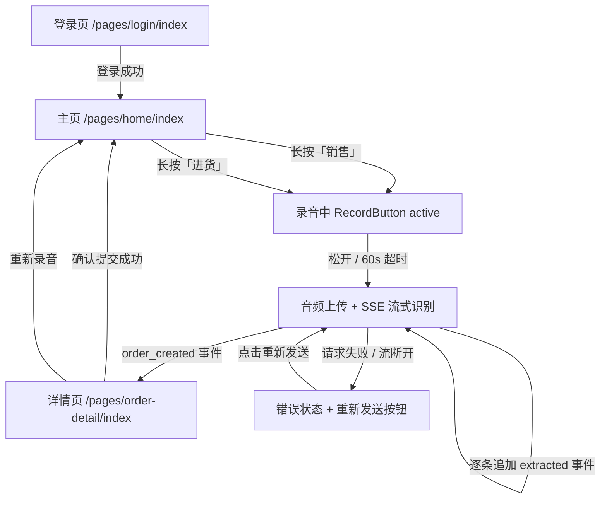
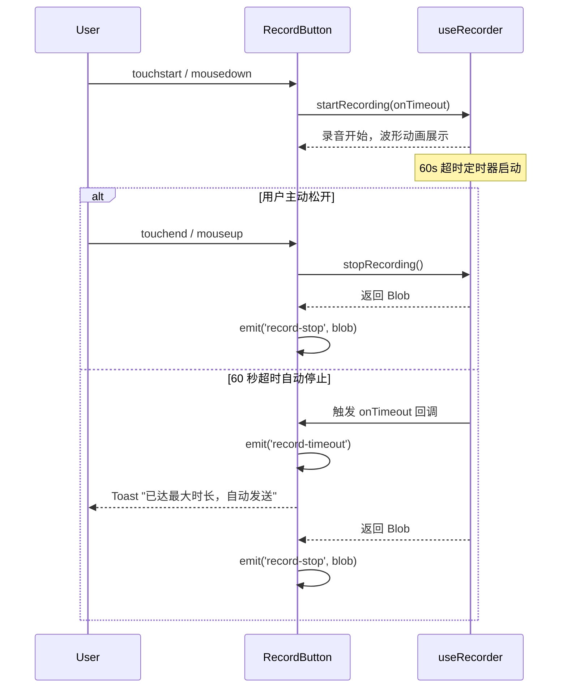
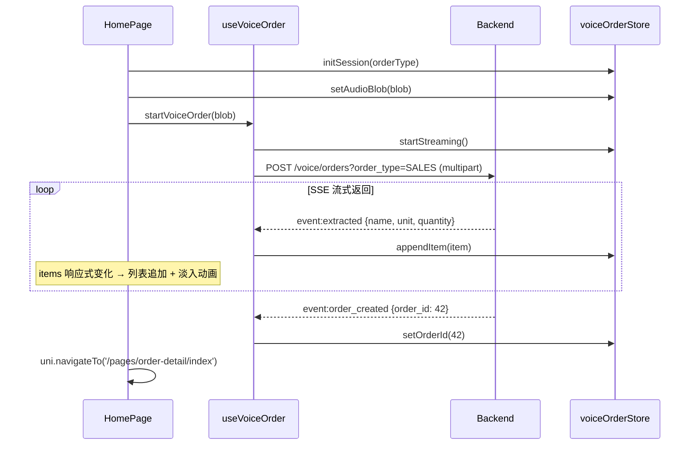
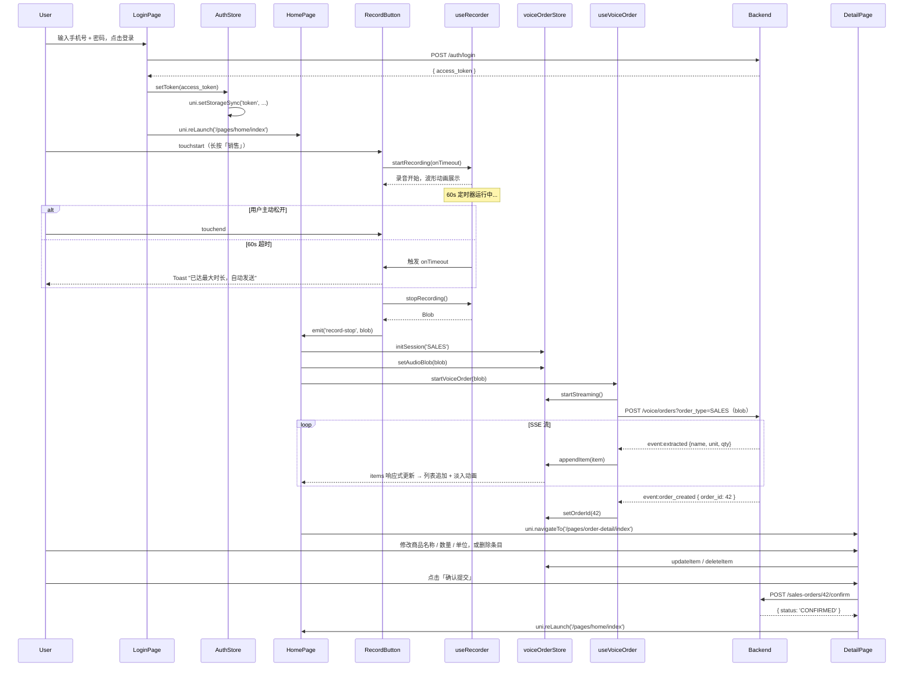

# 智能销售库存系统 — 前端技术实现方案

---

- **版本**：1.0.0
- **日期**：2026-03-03
- **状态**：草稿
- **作者**：AI 首席前端架构师

---

## 目录

1. [技术上下文总结](#1-技术上下文总结)
2. [合宪性审查](#2-合宪性审查)
3. [核心数据结构](#3-核心数据结构)
4. [页面与组件设计](#4-页面与组件设计)
5. [状态管理方案](#5-状态管理方案)
6. [关键流程实现](#6-关键流程实现)
7. [接口对接约定](#7-接口对接约定)

---

## 1. 技术上下文总结

### 1.1 技术选型

| 层次 | 技术选型 | 版本/说明 |
| --- | --- | --- |
| 跨端框架 | **uni-app v3** | 同时支持微信小程序（主端）、H5 |
| UI 框架 | **Vue 3 + Composition API** | `<script setup lang="ts">` 强制使用 |
| 类型系统 | **TypeScript 5.x**（strict 模式） | 零 `any`，全量类型覆盖 |
| 构建工具 | **Vite + @dcloudio/vite-plugin-uni** | — |
| 状态管理 | **Pinia**（Setup Store 风格） | 跨页面状态、录音会话、订单上下文 |
| UI 组件库 | **uview-plus** | 按钮、表单、Toast、骨架屏等 |
| 通用网络请求 | **luch-request** | 带拦截器，用于登录、确认提交等 |
| 流式音频上传 | **平台分支处理** | H5：Fetch API Streaming；小程序：`wx.uploadFile` + `enableChunked` |
| 代码规范 | **ESLint + Prettier + Stylelint** | pre-commit 钩子强制检查 |
| 测试 | **Vitest + @vue/test-utils** | 核心 composable 与工具函数单元测试 |
| 工具函数 | **dayjs + lodash-es** | — |

### 1.2 项目目录结构（本需求涉及部分）

```
src/
├── assets/
├── components/
│   ├── base/
│   │   ├── BaseButton.vue
│   │   └── BaseInput.vue
│   └── business/
│       ├── RecordButton.vue        # 长按录音按钮（核心）
│       ├── OrderItemRow.vue        # 单据条目行（可编辑）
│       ├── StreamingItemList.vue   # 流式条目列表
│       └── CaptchaBlock.vue        # 验证码区块
├── composables/
│   ├── useRecorder.ts              # 录音状态机
│   ├── useVoiceOrder.ts            # 音频上传 + SSE 流处理
│   └── useOrderEdit.ts             # 单据编辑逻辑
├── constants/
│   └── index.ts                    # MAX_RECORD_SECONDS、OrderType 等
├── pages/
│   ├── login/
│   │   └── index.vue
│   ├── home/
│   │   └── index.vue
│   └── order-detail/
│       └── index.vue
├── platform/
│   ├── h5/
│   │   └── streamRequest.ts        # Fetch API 流式请求实现
│   └── mp-weixin/
│       └── streamRequest.ts        # wx.uploadFile + enableChunked 实现
├── services/
│   ├── auth/
│   │   └── index.ts
│   └── order/
│       └── index.ts
├── stores/
│   ├── auth.ts                     # Token、用户信息
│   └── voiceOrder.ts               # 当前录音会话、流式结果、订单上下文
├── types/
│   ├── api/
│   │   ├── auth.ts
│   │   └── order.ts
│   └── models/
│       └── order.ts
└── utils/
    ├── request.ts                  # luch-request 实例及拦截器
    └── routeGuard.ts               # 路由守卫工具函数
```

---

## 2. 合宪性审查

> 逐条对照 `constitution.md` 确认本方案合规。

| 条款 | 审查结论 | 说明 |
| --- | --- | --- |
| **第一条 1.1 YAGNI** | ✅ 合规 | 仅实现 spec.md 明确要求的功能：登录、主页、录音、流式展示、详情编辑、确认、重试，无超前抽象 |
| **第一条 1.2 组件粒度** | ✅ 合规 | `RecordButton`、`OrderItemRow`、`StreamingItemList` 各 ≤ 200 行，职责单一 |
| **第一条 1.3 反过度工程** | ✅ 合规 | 表单字段等页面临时状态用 `ref`；录音会话/订单上下文跨页面共享才用 Pinia |
| **第一条 1.4 依赖最小化** | ✅ 合规 | 无新增依赖；流式请求使用平台原生 API，不引入第三方 SSE 库 |
| **第二条 2.1 禁用 any** | ✅ 合规 | 所有类型在 `src/types/` 下以 `interface` 严格定义；SSE 响应使用 `unknown` + 类型守卫解析 |
| **第二条 2.2 接口优于类型别名** | ✅ 合规 | 数据对象均用 `interface`；订单类型用 `type OrderType = 'SALES' \| 'PURCHASE'` |
| **第二条 2.3 API 类型同步** | ✅ 合规 | 所有请求/响应类型集中在 `src/types/api/` 下，不在业务代码中内联定义 |
| **第二条 2.4 Props 类型声明** | ✅ 合规 | 所有组件 props 使用 TypeScript interface 声明，禁止运行时 PropType 替代 |
| **第三条 测试先行** | ✅ 合规 | `useRecorder`、`useVoiceOrder`、`routeGuard` 等安排 Vitest 测试 |
| **第四条 4.1 错误处理** | ✅ 合规 | 登录、上传、确认均显式 `try/catch`；SSE 断开有专属 Error 状态并提供重发入口 |
| **第四条 4.2 无隐式全局状态** | ✅ 合规 | 所有 store 状态变更通过 actions 进行，不在 setup 外直接赋值 |
| **第四条 4.4 魔法数字** | ✅ 合规 | `MAX_RECORD_SECONDS = 60` 等均在 `src/constants/index.ts` 定义为命名常量 |
| **第五条 5.2 单位规范** | ✅ 合规 | 样式使用 `rpx`，边框用 `1px`，禁止布局中硬编码 `px` |
| **第五条 5.3 平台差异隔离** | ✅ 合规 | 流式请求平台差异封装在 `src/platform/h5/` 和 `src/platform/mp-weixin/` 中 |
| **第六条 6.1 组件职责** | ✅ 合规 | `RecordButton` 是展示型组件，仅 emit 事件；`home/index.vue` 是容器，负责编排 |
| **第六条 6.3 Store 模块化** | ✅ 合规 | `auth.ts` 管认证，`voiceOrder.ts` 管录音会话，职责分离，无"上帝 store" |

**结论：本技术方案与宪法完全相符，可进入实施阶段。**

---

## 3. 核心数据结构

### 3.1 常量定义

```typescript
// src/constants/index.ts

/** 最大录音时长（秒） */
export const MAX_RECORD_SECONDS = 60

/** 订单类型 */
export type OrderType = 'SALES' | 'PURCHASE'

/** SSE 事件类型枚举 */
export enum SseEventType {
  Transcribed = 'transcribed',
  Extracted = 'extracted',
  OrderCreated = 'order_created',
  Error = 'error',
}

/** 录音/上传流程状态枚举 */
export enum RecordStatus {
  Idle = 'idle',
  Recording = 'recording',
  Uploading = 'uploading',
  Streaming = 'streaming',
  Done = 'done',
  Error = 'error',
}
```

### 3.2 API 层类型（与后端 Schema 严格对齐）

```typescript
// src/types/api/auth.ts

/** 登录请求 */
export interface LoginRequest {
  phone: string
  password: string
}

/** 登录响应 */
export interface LoginResponse {
  access_token: string
  token_type: string
}
```

```typescript
// src/types/api/order.ts

/** 销售单明细 DTO（后端返回） */
export interface SalesItemDto {
  product_id: number
  product_name: string
  unit: string
  quantity: string
  unit_price: string
  amount: string
}

/** 销售单 DTO（后端返回） */
export interface SalesOrderDto {
  id: number | null
  tenant_id: string
  order_no: string | null
  created_at: string | null
  total_amount: string | null
  items: SalesItemDto[]
  status: string | null
}

/** 进货单明细 DTO（后端返回） */
export interface PurchaseItemDto {
  product_id: number
  product_name: string
  unit: string
  quantity: string
  unit_price: string
  amount: string
}

/** 进货单 DTO（后端返回） */
export interface PurchaseOrderDto {
  id: number | null
  tenant_id: string
  order_no: string | null
  created_at: string | null
  total_amount: string | null
  items: PurchaseItemDto[]
  status: string | null
}

/** SSE extracted 事件 payload — 单条识别商品 */
export interface SseExtractedPayload {
  name: string
  unit: string
  quantity: string
  unit_price?: string
  amount?: string
}

/** SSE order_created 事件 payload */
export interface SseOrderCreatedPayload {
  order_id: number
  order_type: 'SALES' | 'PURCHASE'
  order: SalesOrderDto | PurchaseOrderDto
}

/** SSE error 事件 payload */
export interface SseErrorPayload {
  message: string
}
```

### 3.3 前端业务模型类型

```typescript
// src/types/models/order.ts
import type { OrderType, RecordStatus } from '@/constants'

/**
 * 前端内部可编辑订单条目。
 * 由 SSE extracted 事件填充，支持用户在详情页修改。
 */
export interface EditableOrderItem {
  /** 客户端生成的临时 ID，用于列表渲染 key */
  clientId: string
  name: string
  unit: string
  quantity: string
  unit_price: string
  amount: string
}

/**
 * 当前语音录入会话上下文，跨页面共享（存储于 voiceOrderStore）。
 */
export interface VoiceOrderSession {
  orderType: OrderType
  items: EditableOrderItem[]
  orderId: number | null
  /** 原始录音 Blob，用于流式失败时重发 */
  audioBlob: Blob | null
  status: RecordStatus
  errorMessage: string | null
}
```

---

## 4. 页面与组件设计

### 4.1 页面流转



### 4.2 组件树与职责说明

#### 登录页（`pages/login/index.vue`）— 容器组件

```
login/index.vue
  ├── BaseInput           手机号输入框
  ├── BaseInput           密码输入框
  ├── CaptchaBlock.vue    验证码区块（错误次数达阈值后显示）
  │   ├── <image>         验证码图片（点击刷新）
  │   └── BaseInput       验证码输入框
  └── BaseButton          「登录」按钮
```

| 组件 | 职责 | 关键内部状态 |
| --- | --- | --- |
| `login/index.vue` | 协调表单逻辑、调用登录服务、触发 Toast | `phone`, `password`, `captchaCode`, `captchaVisible`, `captchaUrl`, `loading` |
| `CaptchaBlock.vue` | 展示验证码图片与输入框 | Props: `visible`, `imageUrl`；Emits: `refresh`, `update:value` |

#### 操作主页（`pages/home/index.vue`）— 容器组件

```
home/index.vue
  ├── RecordButton.vue    「销售」按钮（label="销售"）
  └── RecordButton.vue    「进货」按钮（label="进货"）
```

| 组件 | 职责 | 关键内部状态 |
| --- | --- | --- |
| `home/index.vue` | 监听 `record-stop` 事件，初始化 store，调用 `useVoiceOrder` | `errorVisible`（流失败时展示重发区域） |
| `RecordButton.vue` | 长按录音 UI，emit 录音事件，展示波形动画 | `pressing: boolean`, `showWave: boolean` |

**RecordButton Props & Emits：**

```typescript
interface Props {
  label: string      // '销售' | '进货'
  disabled?: boolean
}

// emit('record-start')               — 开始按下
// emit('record-stop', blob: Blob)    — 松开或超时后，携带录音 Blob
// emit('record-timeout')             — 60 秒超时自动停止
```

#### 单据详情页（`pages/order-detail/index.vue`）— 容器组件

```
order-detail/index.vue
  ├── StreamingItemList.vue   条目列表（含骨架屏 + 可编辑条目）
  │   ├── LoadingRow.vue      骨架屏（streaming 状态展示）
  │   └── OrderItemRow.vue    可编辑条目（带淡入动画）
  │       ├── BaseInput       商品名称
  │       ├── BaseInput       数量
  │       ├── BaseInput       单位
  │       └── <button>        删除
  └── ActionBar.vue           底部操作栏
      ├── BaseButton          「重新录音」
      └── BaseButton          「确认提交」
```

| 组件 | 职责 | 关键内部状态 |
| --- | --- | --- |
| `order-detail/index.vue` | 读取 store items，调用确认 API，处理路由跳转 | `submitting: boolean` |
| `StreamingItemList.vue` | 渲染条目列表；streaming 时展示骨架屏 | Props: `items: EditableOrderItem[]`, `streaming: boolean` |
| `OrderItemRow.vue` | 单条条目可编辑 UI | Props: `item: EditableOrderItem`；Emits: `update:item`, `delete` |
| `ActionBar.vue` | 底部两按钮 | Props: `loading: boolean`；Emits: `rerecord`, `confirm` |

---

## 5. 状态管理方案

### 5.1 `stores/auth.ts` — 认证状态

```typescript
// src/stores/auth.ts
import { defineStore } from 'pinia'
import { ref, computed } from 'vue'

export const useAuthStore = defineStore('auth', () => {
  // 初始化时从持久化存储中恢复
  const token = ref<string>(uni.getStorageSync('token') ?? '')

  const isLoggedIn = computed(() => !!token.value)

  /** 登录成功后调用，同步持久化到 localStorage */
  function setToken(newToken: string) {
    token.value = newToken
    uni.setStorageSync('token', newToken)
  }

  /** 登出：清除 token 并跳转登录页 */
  function logout() {
    token.value = ''
    uni.removeStorageSync('token')
    uni.reLaunch({ url: '/pages/login/index' })
  }

  return { token, isLoggedIn, setToken, logout }
})
```

### 5.2 `stores/voiceOrder.ts` — 语音录入会话状态

```typescript
// src/stores/voiceOrder.ts
import { defineStore } from 'pinia'
import { ref } from 'vue'
import { RecordStatus } from '@/constants'
import type { OrderType } from '@/constants'
import type { EditableOrderItem } from '@/types/models/order'

export const useVoiceOrderStore = defineStore('voiceOrder', () => {
  const orderType = ref<OrderType>('SALES')
  const items = ref<EditableOrderItem[]>([])
  const orderId = ref<number | null>(null)
  const audioBlob = ref<Blob | null>(null)
  const status = ref<RecordStatus>(RecordStatus.Idle)
  const errorMessage = ref<string | null>(null)

  /** 初始化新会话（不清除 audioBlob，保留重发能力） */
  function initSession(type: OrderType) {
    orderType.value = type
    items.value = []
    orderId.value = null
    status.value = RecordStatus.Idle
    errorMessage.value = null
  }

  function setAudioBlob(blob: Blob) {
    audioBlob.value = blob
    status.value = RecordStatus.Uploading
  }

  function startStreaming() {
    status.value = RecordStatus.Streaming
  }

  function appendItem(item: EditableOrderItem) {
    items.value.push(item)
  }

  function setOrderId(id: number) {
    orderId.value = id
    status.value = RecordStatus.Done
  }

  function updateItem(clientId: string, patch: Partial<EditableOrderItem>) {
    const idx = items.value.findIndex(i => i.clientId === clientId)
    if (idx !== -1) {
      items.value[idx] = { ...items.value[idx], ...patch }
    }
  }

  function deleteItem(clientId: string) {
    items.value = items.value.filter(i => i.clientId !== clientId)
  }

  /** 标记错误，保留 audioBlob 以支持重发 */
  function setError(message: string) {
    status.value = RecordStatus.Error
    errorMessage.value = message
  }

  return {
    orderType, items, orderId, audioBlob, status, errorMessage,
    initSession, setAudioBlob, startStreaming, appendItem,
    setOrderId, updateItem, deleteItem, setError,
  }
})
```

### 5.3 状态选用原则汇总

| 状态类型 | 存储方式 |
| --- | --- |
| JWT Token、登录状态 | `authStore`（Pinia）+ `uni.setStorageSync` 持久化 |
| 录音 Blob、SSE 流结果、订单 ID、流程状态 | `voiceOrderStore`（Pinia），内存 |
| 表单字段（手机号、密码、验证码） | 页面级 `ref` |
| 按钮按压状态、波形动画 | `RecordButton` 内部 `ref` |
| 详情页提交中状态 | 页面级 `ref` |

---

## 6. 关键流程实现

### 6.1 长按录音 — 事件处理与超时逻辑



**`composables/useRecorder.ts`：**

```typescript
// src/composables/useRecorder.ts
import { ref } from 'vue'
import { MAX_RECORD_SECONDS } from '@/constants'

/**
 * 录音状态机。
 * H5 使用 MediaRecorder；微信小程序使用 uni.getRecorderManager()。
 * 内置 60 秒超时自动停止逻辑。
 */
export function useRecorder() {
  const isRecording = ref(false)
  let timeoutTimer: ReturnType<typeof setTimeout> | null = null

  // #ifdef H5
  let mediaRecorder: MediaRecorder | null = null
  const chunks: BlobPart[] = []
  // #endif

  // #ifdef MP-WEIXIN
  const recorderManager = uni.getRecorderManager()
  // #endif

  async function startRecording(onTimeout: () => void): Promise<void> {
    if (isRecording.value) return
    isRecording.value = true

    // #ifdef H5
    const stream = await navigator.mediaDevices.getUserMedia({ audio: true })
    mediaRecorder = new MediaRecorder(stream)
    chunks.length = 0
    mediaRecorder.ondataavailable = (e) => { chunks.push(e.data) }
    mediaRecorder.start()
    // #endif

    // #ifdef MP-WEIXIN
    recorderManager.start({ duration: MAX_RECORD_SECONDS * 1000, format: 'm4a' })
    // #endif

    timeoutTimer = setTimeout(() => {
      onTimeout()
      stopRecording()
    }, MAX_RECORD_SECONDS * 1000)
  }

  function stopRecording(): Promise<Blob> {
    if (timeoutTimer) {
      clearTimeout(timeoutTimer)
      timeoutTimer = null
    }
    isRecording.value = false

    return new Promise((resolve) => {
      // #ifdef H5
      if (mediaRecorder) {
        mediaRecorder.onstop = () => {
          const blob = new Blob(chunks, { type: 'audio/webm' })
          mediaRecorder?.stream.getTracks().forEach(t => t.stop())
          resolve(blob)
        }
        mediaRecorder.stop()
      }
      // #endif

      // #ifdef MP-WEIXIN
      recorderManager.onStop((res) => {
        // 小程序返回 tempFilePath，封装为 Blob 占位；
        // 实际上传时 platform/mp-weixin/streamRequest.ts 直接使用 tempFilePath
        resolve(new Blob([res.tempFilePath as unknown as BlobPart], { type: 'audio/m4a' }))
      })
      recorderManager.stop()
      // #endif
    })
  }

  return { isRecording, startRecording, stopRecording }
}
```

**`RecordButton.vue` 模板事件绑定（兼容触摸 + 鼠标）：**

```html
<view
  class="record-button"
  :class="{ 'record-button--active': pressing }"
  @touchstart.prevent="handlePressStart"
  @touchend.prevent="handlePressEnd"
  @mousedown="handlePressStart"
  @mouseup="handlePressEnd"
>
  <WaveAnimation v-if="pressing" />
  <text>{{ label }}</text>
</view>
```

### 6.2 音频上传 + SSE 流式响应接收与逐条渲染



#### 平台差异封装 — H5 流式请求

```typescript
// src/platform/h5/streamRequest.ts

/**
 * H5 端：Fetch API + ReadableStream 实现 SSE 流式多部分上传。
 */
export async function streamUploadAudio(
  blob: Blob,
  orderType: string,
  token: string,
  onEvent: (eventType: string, data: string) => void,
  signal: AbortSignal,
): Promise<void> {
  const formData = new FormData()
  formData.append('file', blob, 'recording.webm')

  const response = await fetch(
    `${import.meta.env.VITE_API_BASE_URL}/web/voice/orders?order_type=${orderType}`,
    {
      method: 'POST',
      headers: { Authorization: `Bearer ${token}` },
      body: formData,
      signal,
    },
  )

  if (!response.ok || !response.body) {
    throw new Error(`请求失败: HTTP ${response.status}`)
  }

  const reader = response.body.getReader()
  const decoder = new TextDecoder()
  let buffer = ''

  while (true) {
    const { done, value } = await reader.read()
    if (done) break
    buffer += decoder.decode(value, { stream: true })

    // 按 SSE 协议解析 "event:xxx\ndata:{...}\n\n"
    const messages = buffer.split('\n\n')
    buffer = messages.pop() ?? ''
    for (const msg of messages) {
      const lines = msg.split('\n')
      const dataLine = lines.find(l => l.startsWith('data:'))
      const eventLine = lines.find(l => l.startsWith('event:'))
      if (dataLine) {
        const eventType = eventLine?.replace('event:', '').trim() ?? 'message'
        onEvent(eventType, dataLine.replace('data:', '').trim())
      }
    }
  }
}
```

#### 平台差异封装 — 微信小程序流式请求

```typescript
// src/platform/mp-weixin/streamRequest.ts

/**
 * 微信小程序端：wx.uploadFile + enableChunked 实现流式响应接收。
 */
export function streamUploadAudio(
  filePath: string,
  orderType: string,
  token: string,
  onEvent: (eventType: string, data: string) => void,
  onComplete: () => void,
  onError: (err: unknown) => void,
): WechatMiniprogram.UploadTask {
  let buffer = ''
  const decoder = new TextDecoder()

  const task = wx.uploadFile({
    url: `${getApp().globalData.apiBase}/web/voice/orders?order_type=${orderType}`,
    filePath,
    name: 'file',
    header: { Authorization: `Bearer ${token}` },
    success: onComplete,
    fail: onError,
  })

  // @ts-expect-error — enableChunked + onChunkReceived 为扩展 API，类型声明不完整
  task.onChunkReceived(({ data }: { data: ArrayBuffer }) => {
    buffer += decoder.decode(new Uint8Array(data), { stream: true })
    const messages = buffer.split('\n\n')
    buffer = messages.pop() ?? ''
    for (const msg of messages) {
      const lines = msg.split('\n')
      const dataLine = lines.find((l: string) => l.startsWith('data:'))
      const eventLine = lines.find((l: string) => l.startsWith('event:'))
      if (dataLine) {
        const eventType = eventLine?.replace('event:', '').trim() ?? 'message'
        onEvent(eventType, dataLine.replace('data:', '').trim())
      }
    }
  })

  return task
}
```

#### `composables/useVoiceOrder.ts` — 流程编排

```typescript
// src/composables/useVoiceOrder.ts
import { useVoiceOrderStore } from '@/stores/voiceOrder'
import { useAuthStore } from '@/stores/auth'
import { SseEventType } from '@/constants'
import type { SseExtractedPayload, SseOrderCreatedPayload, SseErrorPayload } from '@/types/api/order'
import type { EditableOrderItem } from '@/types/models/order'

/**
 * 语音下单流程编排：音频上传 + SSE 流式处理。
 * 封装平台差异，对外统一暴露 startVoiceOrder / cancel。
 */
export function useVoiceOrder() {
  const store = useVoiceOrderStore()
  const authStore = useAuthStore()
  let abortController: AbortController | null = null

  function handleSseEvent(eventType: string, rawData: string): void {
    let parsed: unknown
    try {
      parsed = JSON.parse(rawData)
    }
    catch {
      return // 忽略非 JSON 数据（如心跳注释行）
    }

    switch (eventType) {
      case SseEventType.Extracted: {
        const payload = parsed as SseExtractedPayload
        const item: EditableOrderItem = {
          clientId: `${Date.now()}-${Math.random().toString(36).slice(2)}`,
          name: payload.name,
          unit: payload.unit,
          quantity: payload.quantity,
          unit_price: payload.unit_price ?? '0',
          amount: payload.amount ?? '0',
        }
        store.appendItem(item)
        break
      }
      case SseEventType.OrderCreated: {
        const payload = parsed as SseOrderCreatedPayload
        store.setOrderId(payload.order_id)
        break
      }
      case SseEventType.Error: {
        const payload = parsed as SseErrorPayload
        store.setError(payload.message)
        break
      }
    }
  }

  async function startVoiceOrder(blob: Blob): Promise<void> {
    store.startStreaming()
    abortController = new AbortController()

    // #ifdef H5
    try {
      const { streamUploadAudio } = await import('@/platform/h5/streamRequest')
      await streamUploadAudio(
        blob,
        store.orderType,
        authStore.token,
        handleSseEvent,
        abortController.signal,
      )
    }
    catch (err: unknown) {
      const error = err as Error
      if (error.name !== 'AbortError') {
        store.setError(error.message || '上传失败，请重试')
      }
    }
    // #endif

    // #ifdef MP-WEIXIN
    // 小程序端使用 platform/mp-weixin/streamRequest，传入 tempFilePath
    // #endif
  }

  function cancel(): void {
    abortController?.abort()
  }

  return { startVoiceOrder, cancel }
}
```

### 6.3 流式失败时保留音频 Blob 并支持重发

**设计要点：**

1. `audioBlob` 存储在 `voiceOrderStore` 中，`setError()` 时**不清除**。
2. 流断开/请求失败 → `setError(message)` → `status = Error`，`audioBlob` 依然可用。
3. 主页或流式区域检测到 `status === Error` 时，展示「重新发送」按钮。
4. 点击「重新发送」→ 清空旧识别结果，直接取出 `audioBlob` 重新调用 `startVoiceOrder`，**无需重新录音**。

```typescript
// home/index.vue 重发逻辑
async function handleResend(): Promise<void> {
  const blob = voiceOrderStore.audioBlob
  if (!blob) return

  // 仅清空识别结果，保留 blob 和 orderType
  voiceOrderStore.items = []
  voiceOrderStore.orderId = null
  voiceOrderStore.errorMessage = null

  await voiceOrder.startVoiceOrder(blob)
}
```

### 6.4 Token 持久化与路由守卫

#### Token 持久化

- 登录成功 → `authStore.setToken(token)` → `uni.setStorageSync('token', token)`。
- Store 初始化时读取 `uni.getStorageSync('token')` 自动恢复，App 冷启动无需重新登录。
- Token 失效（服务端 401）→ `luch-request` 拦截器调用 `authStore.logout()` → 清除并跳转登录页。

#### 路由守卫实现

uni-app 无 Vue Router 全局钩子，采用**页面级守卫**：

```typescript
// src/utils/routeGuard.ts
import { useAuthStore } from '@/stores/auth'

/**
 * 需要登录的页面在 onMounted 中调用此函数。
 * 未登录时自动 reLaunch 到登录页。
 */
export function requireAuth(): void {
  const authStore = useAuthStore()
  if (!authStore.isLoggedIn) {
    uni.reLaunch({ url: '/pages/login/index' })
  }
}
```

```typescript
// pages/home/index.vue
import { onMounted } from 'vue'
import { requireAuth } from '@/utils/routeGuard'

onMounted(() => {
  requireAuth()
})
```

```typescript
// src/utils/request.ts — luch-request 响应拦截器（401 统一处理）
request.interceptors.response.use(
  response => response.data,
  (error) => {
    if (error.statusCode === 401) {
      useAuthStore().logout()
    }
    return Promise.reject(error)
  },
)
```

---

## 7. 接口对接约定

### 7.1 接口列表

| 功能 | 方法 | 路径 | 备注 |
| --- | --- | --- | --- |
| 登录 | `POST` | `/web/auth/login` | 公开接口，无需 Token |
| 语音建单（流式） | `POST` | `/web/voice/orders?order_type=SALES\|PURCHASE` | multipart/form-data；SSE 流式响应 |
| 确认销售单 | `POST` | `/web/sales-orders/{id}/confirm` | 需 Bearer Token |
| 确认进货单 | `POST` | `/web/purchase-orders/{id}/confirm` | 需 Bearer Token |

> 所有接口的 baseURL = `VITE_API_BASE_URL`，后端 `servers[0].url = /web`（路径前缀已含）。
> 语音建单接口因流式需求，**不经 luch-request**，由 `src/platform/` 中的平台实现直接调用。

### 7.2 鉴权约定

- 除登录外所有接口携带请求头：`Authorization: Bearer <token>`
- `luch-request` 请求拦截器自动注入（见 code_convention.md 示例）。
- Token 失效（401）→ 拦截器自动 logout + reLaunch。

### 7.3 登录接口

**请求**
```
POST /web/auth/login
Content-Type: application/json

{
  "phone": "13800138000",
  "password": "yourpassword"
}
```

**响应（200 OK）**
```json
{
  "access_token": "eyJhbGciOiJIUzI1NiIsInR5cCI6IkpXVCJ9...",
  "token_type": "bearer"
}
```

### 7.4 语音建单（流式）接口

**请求**
```
POST /web/voice/orders?order_type=SALES
Content-Type: multipart/form-data
Authorization: Bearer <token>

file: <录音 Blob，字段名固定为 file>
```

**SSE 响应流（Content-Type: text/event-stream）**
```
event: transcribed
data: {"text": "苹果两箱，香蕉三把"}

event: extracted
data: {"name": "苹果", "unit": "箱", "quantity": "2", "unit_price": "0", "amount": "0"}

event: extracted
data: {"name": "香蕉", "unit": "把", "quantity": "3", "unit_price": "0", "amount": "0"}

event: order_created
data: {"order_id": 42, "order_type": "SALES", "order": { ...SalesOrderDto... }}
```

**错误事件**
```
event: error
data: {"message": "音频识别失败，请重试"}
```

### 7.5 确认订单接口

**请求**
```
POST /web/sales-orders/42/confirm
Authorization: Bearer <token>
（无请求体）
```

**响应（200 OK）**
```json
{
  "id": 42,
  "order_no": "SA20260303001",
  "status": "CONFIRMED",
  "total_amount": "260",
  "items": [...]
}
```

### 7.6 Service 层封装

```typescript
// src/services/auth/index.ts
import request from '@/utils/request'
import type { LoginRequest, LoginResponse } from '@/types/api/auth'

/** 用户登录 */
export function login(data: LoginRequest) {
  return request.post<LoginResponse>('/auth/login', data)
}
```

```typescript
// src/services/order/index.ts
import request from '@/utils/request'
import type { SalesOrderDto, PurchaseOrderDto } from '@/types/api/order'

/** 确认销售单 */
export function confirmSalesOrder(id: number) {
  return request.post<SalesOrderDto>(`/sales-orders/${id}/confirm`)
}

/** 确认进货单 */
export function confirmPurchaseOrder(id: number) {
  return request.post<PurchaseOrderDto>(`/purchase-orders/${id}/confirm`)
}
```

---

## 附录：完整端到端时序图



---

*本方案生成于 2026-03-03，依据 spec.md v2.0.0 与 constitution.md v2.0。*
